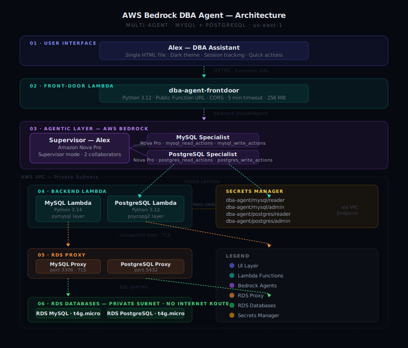

# AWS Bedrock DBA Agent — MVP

A multi-agent AI system built on **AWS Bedrock** that handles common database administration tasks across MySQL and PostgreSQL RDS instances through a natural-language chat interface.

---

## What it does

A supervisor AI agent (named Alex) routes user requests to the appropriate specialist agent, which invokes a Lambda function that executes against the real database.

**Five capabilities — both MySQL and PostgreSQL:**

1. **List available databases** — returns the DB instances in the environment
2. **Show blocking sessions** — surfaces long-running queries with session ID, user, duration, and query text
3. **Kill a blocking session** — terminates a session after explicit user confirmation
4. **Describe a user's privileges** — shows grants and role memberships for any existing user
5. **Clone a user** — creates a new database user by copying privileges from a reference user

---

## Architecture




Six layers, top to bottom:

```
01  Browser — HTML chat UI
         │  HTTPS POST · Lambda Function URL
02  Front-door Lambda
         │  bedrock:InvokeAgent
03  Bedrock Agentic Layer
    ├── Supervisor agent (Alex) — Nova Pro · Supervisor mode
    ├── MySQL Specialist agent  — Nova Pro · 2 action groups
    └── PostgreSQL Specialist agent — Nova Pro · 2 action groups
         │  invoke Lambda (private subnet)
04  Backend Lambda functions
    ├── MySQL Lambda  (Python 3.14 · pymysql)
    └── PostgreSQL Lambda  (Python 3.12 · psycopg2)
         │  connection pool · TLS
05  RDS Proxy
    ├── MySQL Proxy
    └── PostgreSQL Proxy
         │  SQL
06  RDS Databases (private subnet — no internet route)
    ├── MySQL (db.t4g.micro)
    └── PostgreSQL (db.t4g.micro)
```

**Key design decisions:**

- **Multi-agent collaboration** — supervisor routes, specialists execute. Each specialist knows only its engine.
- **Privilege separation** — two DB users per engine: `bedrock_reader` for queries, `bedrock_admin` for writes.
- **Confirmation gates** — write actions require explicit user approval via Bedrock's built-in confirmation mechanism.
- **VPC Interface Endpoint** — Lambda in private subnet reaches Secrets Manager without a NAT Gateway.
- **RDS Proxy** — connection pooling between Lambda and RDS, credentials via Secrets Manager.

---

## Cost — add-on for existing AWS RDS users

If your company already runs on AWS RDS, the incremental cost of this automation is:

| Add-on | Monthly estimate |
|---|---|
| Bedrock model calls (Nova Pro, ~100 requests) | ~$1.50 |
| Lambda invocations | $0.00 (free tier) |
| Secrets Manager (4 secrets) | $1.60 |
| VPC Interface Endpoint (if not already present) | ~$7.00 |
| **Total** | **~$3–10/month** |

No new servers. No SaaS subscription. Pay only for what you use.

---

## Infrastructure required

| Resource | Details |
|---|---|
| VPC | Private subnets (2) for Lambda + RDS, public subnet for bastion |
| RDS MySQL | Any supported version · db.t3/t4g family |
| RDS PostgreSQL | Any supported version · db.t3/t4g family |
| RDS Proxy | One per engine |
| Secrets Manager | 4 secrets — reader + admin per engine |
| Lambda — MySQL | Python 3.14 · pymysql layer · private subnet |
| Lambda — PostgreSQL | Python 3.12 · psycopg2 layer · private subnet |
| Lambda — Front-door | Python 3.12 · public Function URL · NOT in VPC |
| Bedrock Agents | 3 — supervisor + 2 specialists |
| VPC Endpoint | Interface endpoint for Secrets Manager |
| IAM | Lambda role + Bedrock agent execution roles |

---

## Bedrock agent setup

### Supervisor agent
- **Model:** Amazon Nova Pro
- **Mode:** Supervisor (not "Supervisor with routing")
- **Collaborators:** MySQL specialist, PostgreSQL specialist

### Specialist agents
- **Model:** Amazon Nova Pro
- **Action groups:** Two per agent
  - Read group — no confirmation — `list_databases`, `list_blocking_sessions`, `describe_reference_user`
  - Write group — confirmation ON — `kill_session`, `create_user`

> **Important:** Use underscores in action group names, not hyphens. Nova Pro breaks silently on hyphenated names.

---

## Lambda functions

The `lambda/` directory contains three function skeletons with detailed docstrings describing exactly what each function does, which credentials it uses, and what SQL it runs. The implementation is intentionally omitted.

```
lambda/
├── mysql/lambda_function.py       — MySQL action handler (5 functions)
├── postgres/lambda_function.py    — PostgreSQL action handler (5 functions)
└── frontdoor/lambda_function.py   — Public API bridge to Bedrock
```

### Layers required
- **pymysql** — MySQL Lambda (build with `--platform manylinux2014_x86_64`)
- **psycopg2-binary** — PostgreSQL Lambda (Python 3.12 only — no 3.14 wheel)

---

## UI

`ui/dba-agent-ui.html` — single HTML file, no build step, no framework.

```bash
python -m http.server 8080
# Open http://localhost:8080/ui/dba-agent-ui.html
```

Update `LAMBDA_URL` in the script block with your deployed front-door Function URL.

---

## Known gotchas

- **Hyphenated action group names** — silent 424 failures with Nova Pro. Use underscores.
- **Supervisor with Routing mode** — cannot ask follow-up questions. Use Supervisor mode.
- **Private subnet + Secrets Manager** — needs VPC Interface Endpoint.
- **RDS MySQL kill** — use `CALL mysql.rds_kill(id)` not `KILL`. `CONNECTION_ADMIN` not grantable on RDS.
- **psycopg2 on Python 3.14** — no wheel. Use Python 3.12 for the PostgreSQL Lambda.
- **CORS double-header** — set CORS in Function URL config only, not in Lambda response headers too.

---

## Screenshots

See `screenshots/` for proof-of-concept evidence — live chat UI, Bedrock agent config, CloudWatch logs, DB-level verification.

---

## License

MIT
